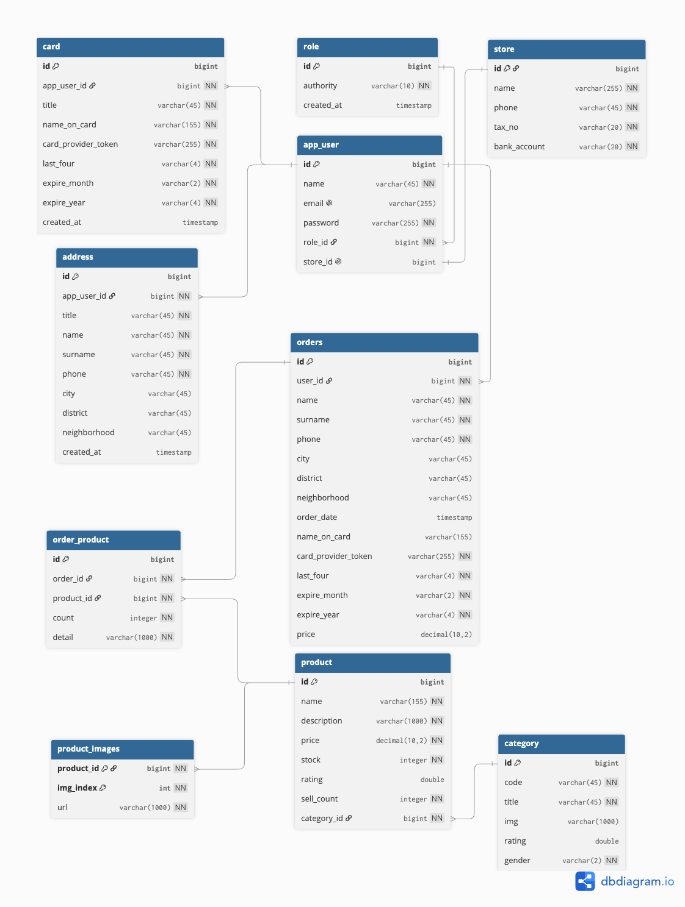

# E-Commerce Platform

A full-stack application consisting of a React-based e-commerce interface and the Spring Boot + PostgreSQL backend that powers it. It covers user registration/login (JWT), product catalog, cart, address & card management, and the order-creation flow.

## Live Demo

| | URL |
|---|---|
| **Frontend** (Vercel) | `https://e-commerce-project-eae.vercel.app/` |
| **Backend API** (Render) | `https://e-commerce-project-b3rx.onrender.com` |

> ⚠️ Since the backend runs on Render's free plan, it goes to sleep after a period of inactivity; the first request may take 30–50 seconds.

## Features

- JWT-based authentication (registration, login, roles, token verification, authorization & authentication)
- Product filtering and listing (CRUD)
- Card and address management (token provider, CRUD)
- Order creation

## Tech Stack

**Frontend**
- React + Vite
- React Router
- Redux (global state)
- Axios

**Backend**
- Java 17, Spring Boot 3
- Spring Data JPA (Hibernate)
- Spring Security + JWT
- Maven

**Database & Deployment**
- PostgreSQL (Render)
- Backend: Render · Frontend: Vercel

## Database Design



Main tables: `role`, `app_user`, `store`, `card`, `address`, `category`, `product`, `product_images`, `order_product`, `orders`.

Key design decisions:
- **Order = historical record.** The `orders` table stores a copy of the address and card information as they were at the moment the order was placed. This way, even if the user later changes or deletes their address/card, past orders still display correctly.
- **Card security.** Raw card numbers are never stored; only a provider reference token and the last 4 digits (for display) are kept (PCI-DSS approach).
- The `orders` table name is intentionally plural — `order` is a reserved keyword in PostgreSQL.
- Monetary fields use `decimal(10,2)` (to avoid floating-point rounding errors).

## API Endpoints

Base URL: `https://e-commerce-project-b3rx.onrender.com`

### Public

| Method | Endpoint | Description |
|-------|----------|----------|
| GET | `/roles` | Lists user roles |
| POST | `/signup` | New user registration |
| POST | `/login` | Login — returns a `token` |
| GET | `/categories` | All categories |
| GET | `/products` | Products (filter/sort/pagination) |
| GET | `/products/{id}` | Single product detail |

**Product query parameters:** `?category=2&filter=siyah&sort=price:desc&limit=25&offset=50`

### Authenticated (protected)

For these requests, the token is sent directly in the `Authorization` header.

| Method | Endpoint | Description |
|-------|----------|----------|
| GET | `/verify` | Verifies the token, returns the user, issues a `new-token` header |
| GET | `/user/card` | User's cards |
| POST | `/user/card` | Adds a new card |
| PUT | `/user/card` | Updates a card |
| DELETE | `/user/card/{cardId}` | Deletes a card |
| GET | `/user/address` | User's addresses |
| POST | `/user/address` | Adds a new address |
| PUT | `/user/address` | Updates an address |
| DELETE | `/user/address/{addressId}` | Deletes an address |
| POST | `/order` | Creates a new order |

### Authentication flow

Upon a successful login, the returned JWT is attached to the `Authorization` header (without the Bearer prefix) on subsequent requests. Given a valid token, the `/verify` endpoint returns the user information and sends a refreshed token in the response's `new-token` header; the frontend captures and stores it to extend the session.

## Local Setup

### Prerequisites
- Node.js 18+
- Java 17+ & Maven
- PostgreSQL 14+

### Backend

```bash
cd backend
```

Provide the following environment variables (via IntelliJ run configuration, system env, or a `.env` tool):

```properties
${DB_URL}
${DB_USERNAME}
${DB_PASSWORD}
${JWT_SECRET}
```

### Frontend

```bash
cd frontend
npm install
npm run dev
```

## Project Structure

```
.
├── frontend/          # React + Vite application
├── backend/           # Spring Boot application
├── docs/
│   └── Diagram.png  # Database diagram
└── README.md
```

## License

This project is for personal/portfolio purposes.

## To do

- Bestseller product cards needs a bugfix check